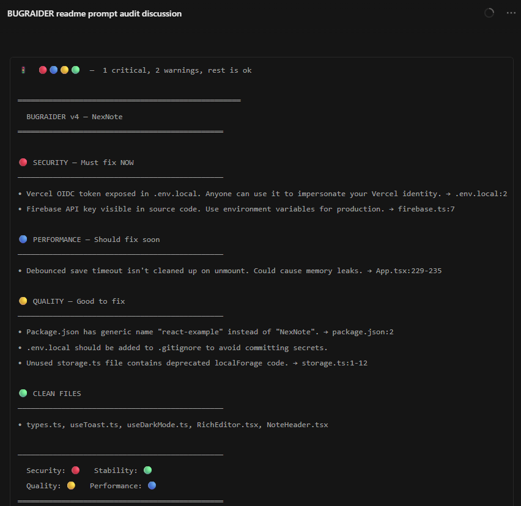
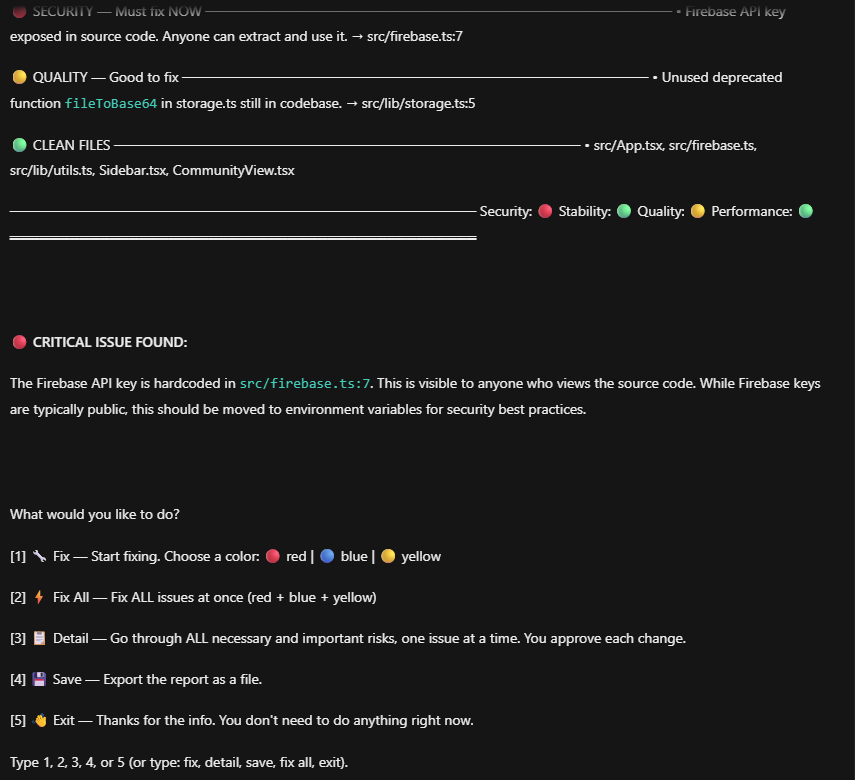

# BUGRAIDER

BUGRAIDER is a professional AI code-audit prompt built to turn modern agents into careful, structured reviewers. It is designed to help inspect real repositories, surface meaningful bugs and security risks, reduce false positives, and keep fixes controlled and reviewable.

This repository is now intentionally centered around a single current release:

- [BUGRAIDER_PROMPT_v5_PRO.md](./BUGRAIDER_PROMPT_v5_PRO.md)

## Preview

## What It Does

BUGRAIDER tells an AI agent to:

- map the project before making assumptions
- audit for security, stability, correctness, performance, and maintainability
- separate confirmed findings from lower-confidence suspicions
- cite exact files and line numbers
- mask secrets instead of exposing them
- avoid modifying code without approval
- guide the user through safe follow-up fixes

## Why v5

`v5` is the cleaned, professionalized release of BUGRAIDER. It improves on earlier drafts with:

- stronger evidence and confidence rules
- better false-positive control
- cleaner report structure
- clearer severity handling
- better batching for large repos
- better diff and regression review support
- safer remediation flow

## Quick Start

1. Open [BUGRAIDER_PROMPT_v5_PRO.md](./BUGRAIDER_PROMPT_v5_PRO.md).
2. Paste it as the system prompt or first message in a fresh AI session.
3. Point the agent at your project.
4. Choose scan mode and review the findings.

## Repository Focus

Older prompt generations and stale repo clutter have been removed so the project stays focused on the current release instead of version sprawl.

## Compatibility

BUGRAIDER is prompt-first and works with most modern coding agents, including:

- ChatGPT
- Claude
- Gemini
- Cursor
- Windsurf
- GitHub Copilot Chat

## Safety Note

BUGRAIDER is a prompt, not a static analyzer. Results still depend on the model, tools, and repository access available in the session. Review findings before applying changes, and keep a backup or git checkpoint before fixing code.

## License

Licensed under the nRn Open Attribution License 2.0. Commercial use is allowed, with attribution to nRn World. See [LICENSE](./LICENSE).
